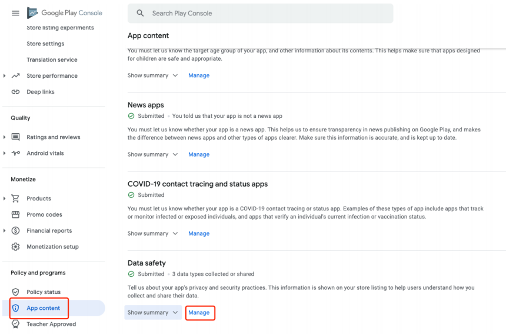
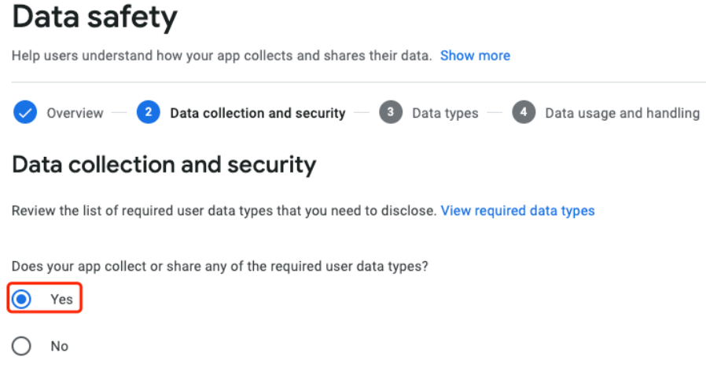
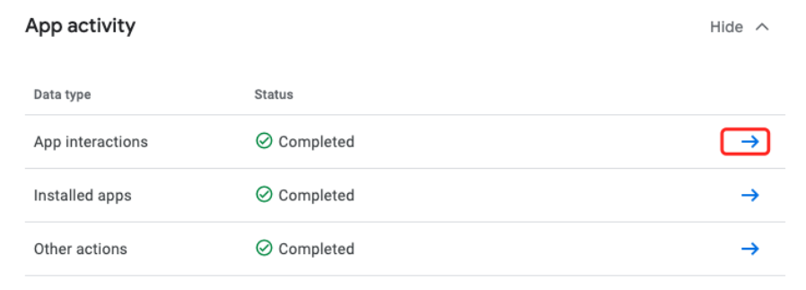
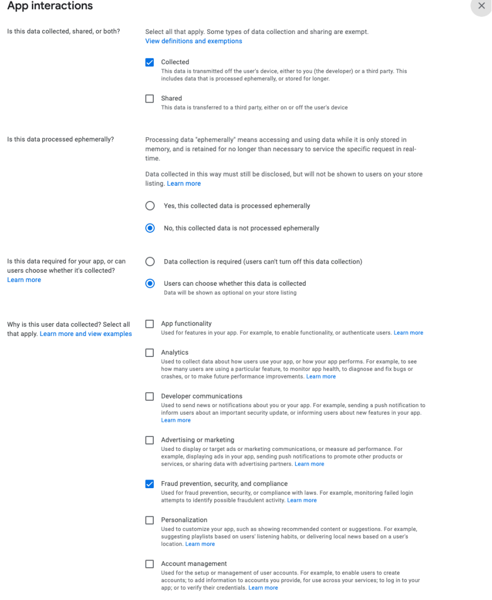

## 1 Overview

​    In January 2019, the Cyberspace Administration of China, the Ministry of Industry and Information Technology, the Ministry of Public Security, and the State Administration for Market Regulation jointly issued the "Announcement on Carrying out Special Rectification of Illegal and Irregular Collection and Use of Personal Information by Apps," marking the beginning of a crackdown on issues such as forced authorization, excessive permissions, and the collection and misuse of personal information by mobile apps. Since the launch of this special rectification campaign, many app operators have been publicly notified or even had their apps forcibly removed from app stores due to their failure to make timely adjustments.

​    To help developers and operators of apps using the Shumei SDK better implement user personal information protection measures and avoid violations of relevant laws, regulations, policies, and standards due to third-party SDKs, we hereby issue this reminder notice. You should add the Shumei SDK privacy statement to the "Data Sharing and Disclosure" section of your "Privacy Policy" in accordance with relevant laws and regulations, as referenced in the "2 Privacy Agreement Statement" section below. The privacy agreement statement applies to the latest stable version of the Shumei Device Fingerprint SDK across all platforms, with optional configuration items available for some platforms, as detailed in the "3 Controllable Configuration Items" section.

## 2 Privacy Agreement Statement

### 2.1 Domestic Version

​    To achieve risk control and fraud identification, thereby protecting your account and transaction security, our product may integrate third-party SDKs or similar applications, as detailed below:

| SDK Name | Company Name             | Platform | Types of Data Collected by SDK                                           | Purpose of SDK                                   | Privacy Policy Link                                  |
| :--------:| ------------------------ | -|----------------------------------------------------------- | ------------------------------------------ | --------------------------------------------- |
| Shumei SDK (com.ishumei) | Beijing Shumei Times Technology Co., Ltd. | Mobile | Necessary Personal Information:<br />1. Basic device information, including device brand, device manufacturer, device model, device name, device system type and version information, device basic settings, device environment;<br />2. Device identification information, including Android ID, OAID, IDFV (Identifier for Vendor), IDFA (Identifier for Advertisers);<br />3. Device network information, including network access form, surrounding WIFI list, network operator information, network connection status;<br />4. Device application information, including SDK host application package name and version number, running process information (only obtaining the current process name), sensor information.<br /><br />Optional Personal Information: MAC address, MediaDRM ID, software list, wireless router identification (BSSID, SSID) and IP address, coarse location information, precise location information, screen resolution. | Used for risk control and anti-fraud to ensure account and transaction security | https://www.ishumei.com/legal/cn/privacy.html |
| Shumei SDK (com.ishumei)         | Beijing Shumei Times Technology Co., Ltd.  |          Mini Program             | Device brand, device model, WiFi list, network type, connected WiFi information, IP information, canvas fingerprint, system version number, WeChat client version number, SDK version number |   Used for risk control and anti-fraud to ensure account and transaction security   | https://www.ishumei.com/legal/cn/privacy.html  |
| Shumei SDK (com.ishumei)         | Beijing Shumei Times Technology Co., Ltd.  |          Web             | Canvas fingerprint, cookies information, UA client browser information |   Used for risk control and anti-fraud to ensure account and transaction security   | https://www.ishumei.com/legal/cn/privacy.html  |


   You should pay sufficient **attention** to the above notification content and further improve the relevant content of your app's "Privacy Policy" in accordance with relevant laws and regulations and the suggestions in this notice. If your app is publicly notified or even removed from app stores due to your failure to timely improve the relevant content of the "Privacy Policy," the relevant responsibility should be **borne by you**.

### 2.2 Overseas Version

**Privacy Advice for Shumei SDK**

We suggest that you should add the following contents to the relevant sections of your app's privacy policy, such as third-party information collection details, advertising or data analysis:

| Name of SDK | Purpose                           | Collected Information                                        | Requested Access                                             |
| ----------- | --------------------------------- | ------------------------------------------------------------ | ------------------------------------------------------------ |
| Shumei SDK  | Data statistics and Anti-cheating | (1) Basic equipment information, including equipment brand, equipment manufacturer, equipment model number, equipment name, equipment system type and version, equipment basic configuration, equipment basic settings, equipment environment;<br />(2) Device identification information,Android ID, IDFV (Identifier For Vendor), IDFA (Identity for Advertisers), OAID (Open Anonymous Device Identifier)<br />(3) Device network information, including network access form, wireless router identification (BSSID, SSID) and IP address, WIFI list, network operator information, network base station information, network connection status<br />(4) Device application information, including SDK host application package name and version number | **For Android**:<br />INTERNET<br />ACCESS_COARSE_LOCATION<br />READ/WRITE_EXTERNAL_STORAGE<br />ACCESS_NETWORK_STATE <br /><br />**For IOS:**<br />INTERNET |
|             |                                   |                                                              |                                                              |

If you receive a warning from Google Play regarding the smsdk containing the following keywords: Installed application information, you can resolve it through the following steps.

Customers who have not received a warning can temporarily ignore this. If you receive other warnings, please provide feedback to Shumei for analysis.

#### 2.2.1 APP Adds Prominent Disclosure Prompt

[Google Official Documentation](https://support.google.com/googleplay/android-developer/answer/11150561#zippy=)

Interface Requirements:

- Use clear and friendly language to request explicit permission from users, such as "Agree," rather than "Allow access" (which may sound intimidating and unclear) or "Got it" (too casual).
- Use at least two options. The first option allows users to grant permission. The second option allows users to refuse consent but can agree to authorization later. Use "Remind me later" or "Skip" to allow you to seek user consent again later.
- Do not use disclosure prompts similar to Android system interface notifications and requests, as this may confuse users.
- Consider matching the background color of the disclosure prompt with the app's style and theme, rather than using white, so that consumers believe the message is from your app.
- Prominent disclosure prompts can be window prompts or part of the user flow in the app interface. For example, if you have a dialogue interface, you can display prominent disclosure prompts and seek user consent text in the dialogue interface while still meeting Play Console requirements.
- If you need to seek user consent again later, be mindful of user fatigue. If users have repeatedly refused consent within the app, respect their choice.

Specific operations are as follows.

##### Disclosure Prompt Exists in APP

If the APP previously added a disclosure prompt, add the ishumei sdk disclosure after it:

...YOUR DISCLOSURE...

In addition, our app collects **Installed application information** with ishuemi SDK, in order to fraud prevention, security, or compliance with laws. For example, monitor whether the device is in the root environment, whether there is a hook risk, and whether it is running on a real device, etc.

Buttons: DENY & ACCEPT

When clicking ACCEPT, start the SDK; when clicking DENY, do not call any smsdk interface, equivalent to not integrating smsdk.

##### No Disclosure Prompt in APP

Add a new disclosure prompt, displayed before starting the smsdk, with the following content (replace XXX with the APP name):

XXX APP ishumei SDK collects **Installed application information** to used for fraud prevention, security, or compliance with laws. For example, monitor whether the device is in the root environment, whether there is a hook risk, and whether it is running on a real device, etc.

Buttons: DENY & ACCEPT

When clicking ACCEPT, start the SDK; when clicking DENY, do not call any smsdk interface, equivalent to not integrating smsdk.

#### 2.2.2 Use Overseas Version of smsdk

The overseas version of smsdk reduces the collection of some data. When the APP is listed on Google Play, the overseas version of smsdk should be used.

#### 2.2.3 Use https Requests

The default for smsdk is to use http requests. You need to actively call the `smOption.setUsingHttps(true)` method to switch to https requests. If it is integrated in proxy mode or private mode, you need to ensure that the URL request is an https request, for example:

```java
smOption.setUrl("YOUR-URL") // YOUR-URL is an https address
smOption.setConfUrl("YOUR-URL") // YOUR-URL is an https address
```

#### 2.2.4 Update Data Safety Statement

Enter the Google Play console, select the warned app, and select Policy and programs -> App content -> Data safety -> Click Manager, as shown:



Select yes for Data collection and security, and choose other options according to the actual situation



After selecting, click "Next" to enter the Data types page, configure App activity and Device or other IDs as follows, and choose other options according to the actual situation


After selecting, click "Next" to enter the Data usage and handling page, configure App activity



The following is the simplest option for App interactions, add according to the actual situation (the handling methods for Installed apps, Other actions, Device or other IDs options are the same)



After filling in, you will enter the Preview page, check for any issues, at least the following two items should be present


Click "Submit" to update.

## 3 Controllable Configuration Items

Developers can refer to the following examples to adjust the SDK data collection items. These methods are used when the APP user agrees to the privacy policy but does not want to report certain information. For the complete SDK integration method, refer to the respective SDK integration documentation.

### 3.1 Android Platform

#### Example

Use this method to block the collection of certain data, here taking oaid as an example. For other controllable information, see: Controllable Field Table

```java
// For detailed integration process, refer to the Android integration documentation
SmAntiFraud.SmOption option = new SmAntiFraud.SmOption();
... // Other settings
// Configure fields not to be collected
Set<String> notCollect = new HashSet<>();
notCollect.add("oaid"); // Indicate not to collect oaid
option.setNotCollect(notCollect);
... // Other settings
SmAntiFraud.create(context, option);
```

#### Controllable Field Table

The field names passed in must match the **Field Name** in the table below (in alphabetical order)

| Field Name        | Meaning                        | Key System API                                                 | Impact After Removal                         |
| ----------------- | --------------------------- | ------------------------------------------------------------ | ---------------------------------- |
| adid              | android_id                  | Secure#getString(Resolver, ANDROID_ID)                       | Affects device identification stability                 |
| bssid             | MAC address of WIFI hotspot        | WifiManager#getConnectionInfo<br />WifiInfo#getBSSID         | Affects the identification of risk device clusters         |
| cell              | Base station information                    | TelephonyManager#getCellLocation<br />GsmCellLocation#getCid<br />GsmCellLocation#getLac | Affects the identification of risk device clusters         |
| drmId             | MediaDRM ID                 | MediaDrm#getPropertyByteArray                                | Affects device identification stability                 |
| launcherInfo      | Desktop application information                | PackageManager#resolveActivity                               | Affects the identification of device environment risks             |
| locationCls       | Location class method detection         | Location#getLongitude<br />Location#getLatitude              | Affects tampered location detection               |
| network           | Mobile network connection method            | TelephonyManager#getNetworkType                              | Affects network status-related logic verification         |
| networkCountryIso | Network country code (ISO format)  | TelephonyManager#getNetworkCountryIso                        | None                               |
| oaid              | Anonymous device identifier in Android development | Key APIs of various phone manufacturers are different                                      | None                               |
| operator          | Operator code                  | TelephonyManager#getSimOperator                              | Affects network status verification                 |
| sdCacheLimit      | SD card cache                   | FileInputStream, FileOutputStream                            | Affects global identifier association capability on lower version systems |
| sensor            | Sensor information                  | SensorManager#getSensorList                                  | Affects logic verification related to tampering recognition       |
| simCountryISO     | SIM card country code (ISO format)    | TelephonyManager#getSimCountryIso                            | None                               |
| ssid              | WIFI name                   | WifiManager#getConnectionInfo<br />WifiInfo#getSSID          | Affects the identification of risk device clusters         |
| wifiip            | Local area network IP address              | WifiManager#getConnectionInfo<br />WifiInfo#getIpAddress     | Affects the identification of risk device clusters         |

Note: The data collected by each SDK version may vary. For specific collection item switch control, refer to the "Device Fingerprint SDK Data Collection List_android*.xlsx" document. The collection list document is issued along with the SDK.

### 3.2 iOS Platform

#### Example

```objective-c
// SDK startup parameter object
SmOption *option = [[SmOption alloc] init];
[option setOrganization: @"YOUR_ORGANIZATION"];
// Configure fields not to be collected
[option setNotCollect:@[@"idfa"]]; // Do not collect idfa
// Start SDK
BOOL isOk = [[SmAntiFraud shareInstance] create:option];
```

#### Controllable Field Table

| Field Name | Meaning         | Impact After Removal |
| ------ | ------------ | ---------- |
| idfa   | Identifier for Advertisers | None       |

### 3.3 Web Platform

#### Example

```js

SMSdk.initConf({
  organization: 'xxxxxxx',
  // ... Other configurations
  // Configure fields not to be collected, if you do not want to collect the following fields, set to true
  notCollect: {
    canvas: false,
    plugins: false,
    referer: false,
    ua: false,
    url: false,
  }
});
```

#### Controllable Field Table

| Field Name  | Meaning             | Impact After Removal                                 |
| ------- | ---------------- | ------------------------------------------ |
| canvas  | Canvas fingerprint         | Affects the identification of tampering and other risk dimensions, affects device identification stability |
| plugins | Browser plugin information   | Affects the identification of tampering and other risk dimensions                     |
| referer | Referrer             | Affects risk scenario identification                           |
| ua      | Browser client identifier | Affects the identification of tampering and other risk dimensions, affects device identification stability |
| url     | Current URL          | Affects risk scenario identification                           |