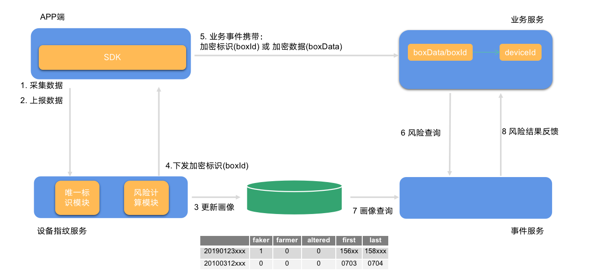
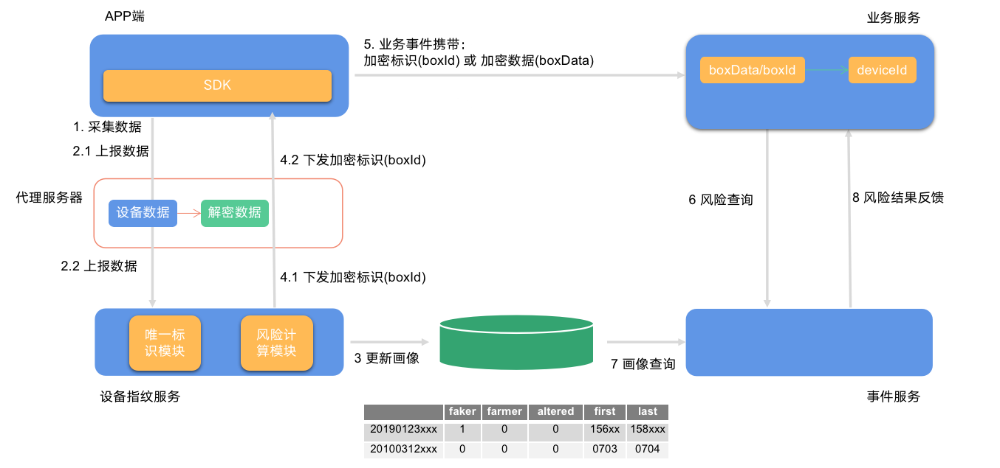

## 1 术语解释

| 术语         | 解释                                                         |
| ------------ | ------------------------------------------------------------ |
| Organization | 组织标识，开通服务获取或单独邮件发送；初始化 SDK 必传参数之一 |
| AppId        | 应用标识，开通服务获取或单独邮件发送；初始化 SDK 必传参数之一 |
| PublicKey    | 加密公钥，开通服务获取或单独邮件发送；初始化 SDK 必传参数之一 |
| boxId        | 设备指纹加密标识，客户端通过getDeviceId()方法获取到的值，以字母 'B' 开头的字符串，长度为 89 个字符 |
| boxData      | 设备指纹加密数据，客户端通过getDeviceId()方法获取到的值，以字母 'D' 开头的字符串，长度约 8K 字符 |
| 标准接入     | SAAS 模式，设备数据托管到数美平台进行统一管理，分为国内、东南亚、欧美机房 |
| 代理接入     | 设备数据优先发送到业务代理服务器，进行数据审查或其他数据管理，业务代理服务器对上传设备数据进行转发 |
| 私有化接入   | 设备数据存放在客户机房，相当于将 SAAS 服务部署到客户机房内   |

## 2 标准接入

非定制化接入全部属于标准接入，标准接入最为简单快速，适用于国内用户接入。标准接入整体数据流图，如下

接入关键步骤

1. App 接入移动端 SDK，移动平台包括：Android/iOS/Web/小程序
2. （图示 1 至 4 ）初始化 SDK 进行数据采集，获取 boxId
3. （图示 5）业务事件如注册、登录等上报业务服务器时携带 boxId 或 boxData
4. （图示 6 至 8）业务服务器根据 boxId 或 boxData 查询设备风险或设备标识

## 3 代理接入

代理接入需要客户搭建代理服务器，设备指纹 SDK 将设备数据通过代理服务器进行中转。代理接入主要有两个目的，目的一，用户海外接入，数据优先经过业务代理服务器，进行数据合规处理；目的二，用户需要借助采集数据进行二次开发。代理接入整体数据流图，如下

接入关键步骤

1. App 接入移动端 SDK，移动平台包括：Android/iOS/Web/小程序
2. 搭建代理服务器，代理服务器中可以将图示 2.1 中上报设备数据进行解密，可对数据进行数据审核或其他二次开发。
3. （图示 1 至 4.2）采集并透传设备数据和 boxId
4. （图示 5）业务事件如注册、登录等上报业务服务器时携带 boxId 或 boxData
5. （图示 6 至 8）业务服务器根据 boxId 或 boxData 查询设备风险或设备标识

代理服务器需要客户自行搭建，需要确保其稳定性，避免由于代理服务器导致的数据异常问题。

## 4 私有化接入

私有化接入属于高度定制，需要数美提供部署服务，包括设备指纹服务、设备画像、事件服务等。部署完成有，整个数据流与标准接入相同，不同点在于所有服务都部署在客户机房。
