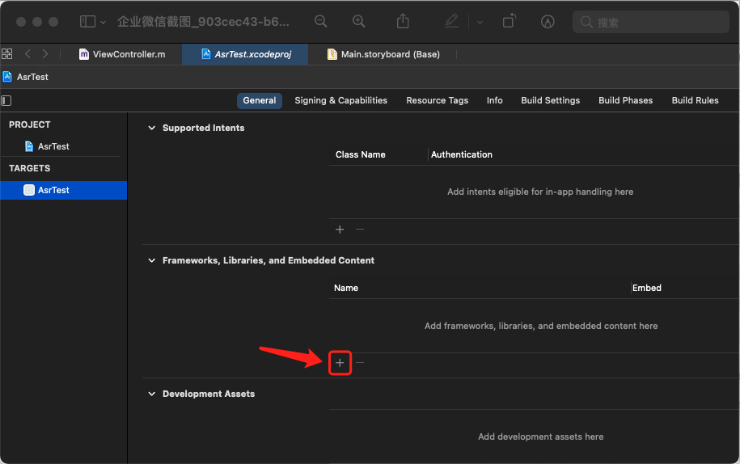
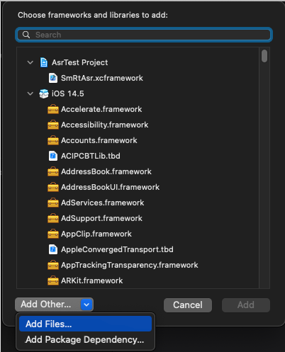
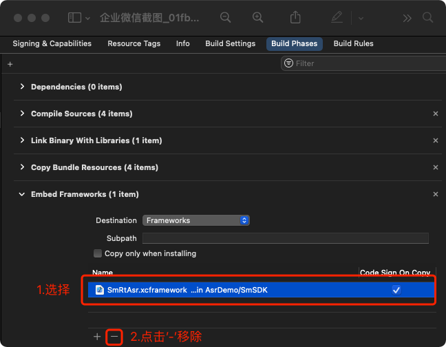

# iOS Real-time Audio Transcription SDK Integration Steps

1. **Import SDK Package**

   1. Copy `SmRtAsr.xcframework` into the project.

   2. Open the project with Xcode, click on the project, click on the corresponding target, and select the General page.

   3. In Frameworks, select `Frameworks, Libraries, and Embedded Content`, click the `+` sign -> Add Other -> Add Files -> select `SmRtAsr.xcframework`. As shown below:

      

      

   4. In the target's `Build Phases`, uncheck the reference to `SmRtAsr.xcframework` under `Embed Frameworks`, as shown below:

      

   5. The SDK supports a minimum of iOS 9 and supports bitcode.

   6. To use the SDK in the project, import the header file.

      ```objective-c
      #import <SmRtAsr/SmRtAsr.h>
      ```

2. **SDK Code Integration**

   1. Initialization

      ```objective-c
      SmRtAsrOption *option = [[SmRtAsrOption alloc] init];
      // Required parameter, Organization provided by SmRt
      [option setOrganization:@YOUR_ORGANIZATION];
      // Required parameter, AccessKey provided by SmRt
      [option setAccessKey:@YOUR_ACCESS_KEY];
      // Optional parameter, default value is "default"
      [option setAppId:@YOUR_ACCESS_KEY];
      // Optional parameter, set the websocket data transmission server location, contact SmRt support for the location
      [option setWsUrl:@WS_URL];
      // Optional parameter, set the http data transmission server location, contact SmRt support for the location, will temporarily switch to http communication if websocket communication fails
      [option setHttpUrl:@HTTP_URL];	
      // Start
      SmRtAsrClient *client = [[SmRtAsrClient shareInstance] initWithOption:option];
      ```

      If required parameters are empty or have format issues, such as containing whitespace characters, the `create` method will return a `nil` object. Please modify the relevant parameters according to the xcode console prompts, with the log TAG being `Smlog`.

   2. Implement SmRtDelegate

       Implement SmRtDelegate and the methods onRtError and onRtReceived, as shown below:

      ```objective-c
      @interface ViewController ()<SmRtDelegate>
      
      @end
      
      @implementation ViewController
      
      - (void)onRtReceived:(NSString *)sessionId requestId:(NSString *)requestId response:(SmAsrResponse *)response
      {
        // Data returned from the server, this method will be triggered multiple times during postAudio
      }
        
      - (void)onRtError:(NSString *)sessionId requestId:(NSString *)requestId errorCode:(NSInteger)errorCode message:(NSString *)message
      {
        // errorCode, specific values and meanings can be found in the error code table
      }
      
      @end
      ```

      The `SmAsrResponse` part is defined as follows:

      ```objective-c
      @interface SmAsrResponse : NSObject
      
      // Recognition result
      @property NSString *text;
      // Recognition result identifier 
      //  0: Intermediate sentence 
      //  1: Complete sentence
      @property NSInteger type;
      // Determine if a keyword is hit, YES means hit
      -(BOOL) isHit;
      // Matching results
      @property NSArray<NSDictionary*> *matchedResults;
      // Number extraction function return
      @property NSArray<NSDictionary*> *numbers;
      
      @end
      ```

      According to the `SmAsrResponse` structure, you can access the corresponding values.

      The key values and value types contained in `matchedResults` are as follows:

      ```txt
      [{
        // Matched content, String type
        "hitItemContent": "你好", // Numbers equal to this field value as a numeric string, such as "123"	
        // Start (inclusive) and end (exclusive) positions of the matched content in the original text, if the matched content appears multiple times, multiple positions will appear
        "positions": [[0, 2], [2, 4]]
      }, {
        "hitItemContent": "世界", 
        "positions": [[5, 7]]
      }]
      ```

      The key values and value types contained in `numbers` are as follows:

      ```txt
      [{
        // Extracted number, integer type
        "number": 123,	
        // Start and end positions of the extracted number in the original text, if the matched content appears multiple times, multiple positions will appear
        "positions": [[0, 3], [5, 8]]
      }, {
       "number": 456,	
        "positions": [[10, 13]]
      }]
      ```

   3. Start Session

      ```objective-c
      SmRtSessionConfig *config = [[SmRtSessionConfig alloc] init];
      // Set session language, default is "zh", format: http://www.lingoes.cn/zh/translator/langcode.htm
      [config setLanguage:@"zh"];
      // Set whether matching function is needed, default is NO, if set to YES, matching content must be set
      [config setEnableMatch:YES];
      // Matching mode, keyword contains matching mode, supports parameters
      //  - text: Text contains matching (default value)
      //  - number: Number equals matching
      [config setMatchMode:@"text"];
      // Matching content, up to 5 keywords, each less than or equal to 30 characters
      [config setKeyWords: @[@YOUR_KEYWORDS]];	
      // Set whether to return transcription text, default is YES
      [config setReturnText:YES];
      // Set whether number extraction function is needed, default is NO
      [config setReturnNumbers:YES];
      // Set audio type, default is pcm
      [config setVoiceType:@"pcm"];
      // Set audio sampling rate, default is 16000
      [config setVoiceSample:16000];
      // Set audio encoding format, default is s16le
      [config setVoiceEncode:@"s16le"];
      // Extension field
      [config setExtra:@{}]
      // Set SmRtDelegate callback, note: the callback method is in the main thread, do not perform time-consuming operations directly in the callback method.
      [config setDelegate:self];
      [client startSession:config];
      ```

      After starting the session, you can send audio data. If no audio data is sent for a period of time after starting the session, the session will expire and need to be restarted. The SDK currently does not support multi-session interaction, multiple calls to `startSession` will only make the latest session valid.

   4. Send Audio Data

      ```objective-c
      // Send audio data
      //
      // This method will copy the audio data and then process the copied data internally for reporting. To ensure recognition accuracy, do not modify the audio data during the copying process.
      //
      // @param audio Audio data, default type: pcm, encoding: s16le, sampling: 16000
      // @return Whether sending audio data was successful
      //  - NO: No session started, or session failure caused the current audio to not be added to the forwarding queue
      //  - YES: Sent successfully, the result will be displayed in the {onRtReceived} callback
      -(BOOL) postAudio:(NSData *)audio;
      ```

      Each audio slice needs to be controlled between 300 to 400 milliseconds.

      After sending audio data, you can listen to the callback results in `- (void)onRtReceived:(NSString *)sessionId requestId:(NSString *)requestId response:(SmAsrResponse *)response`, for example, call `response.text` to get the current audio-to-text information, and use `[response isHit]` to determine if the current audio hits a keyword.

   5. Close Session

      ```objective-c
      // End session
      [client stopSession];
      ```

   6. Destroy SDK

      ```objective-c
      // Destroy SDK and release resources
      [client destroy];
      ```

      Calling the `destroy` method will release resources such as network threads, cached data, etc.

3. **Error Codes**

   | Error Code | Message       | Cause                                                         | Recommended Handling                                         |
   | ---------- | ------------- | ------------------------------------------------------------- | ------------------------------------------------------------ |
   | 1901       | qps limit     | Request reached the server's preset qps limit                 | If triggered frequently, contact SmRt personnel to increase the qps limit |
   | 1902       | Invalid parameter | Parameter error                                             | 1. Call stopSession to end the current session<br />2. Check if Organization and AccessKey are filled in correctly |
   | 2101       | No network    | Device has no network                                         | Ignore                                                       |
   | 2102       | Voice packet loss | Network anomaly caused voice segment to not be uploaded to the server | Ignore                                                       |
   | 2103       | Voice abandoned | Sending voice packets too frequently (e.g., more than 100 segments sent in 4 seconds) exceeded the cache limit, causing new voice segments to be discarded | Ignore                                                       |
   | 2301       | State error   | SDK API call error, such as calling startSession without starting | Ensure to start first                                        |
   | 2401       | Server error  | Server did not send data according to the protocol            | Ignore                                                       |
   | 2402       | Server error  | Server did not send data according to the protocol            | Ignore                                                       |
   | 2403       | Server error  | Server did not send data according to the protocol            | Ignore                                                       |
   | 9101       | Unauthorized operation | Parameter error or related service not activated           | Call stopSession to end the current session<br />Check if Organization and AccessKey are filled in correctly, contact SmRt personnel to check if related services are activated |